# FlyReq Image Studio

<p align="right"><strong>English</strong> | <a href="./README.zh-CN.md">简体中文</a></p>

<div align="center">

**A self-hosted AI image studio for multi-model workflows, real-time jobs, and production deployments.**

[](https://github.com/doudou770/flyreq-image-studio)
[](LICENSE)
[](https://nodejs.org)
[](https://nextjs.org)
[](https://react.dev)

</div>

---

## Overview

FlyReq Image Studio is a self-hosted workspace for AI image generation. It combines a static Next.js 16 + React 19 PWA frontend with a lightweight Node.js, SQLite, and WebSocket backend that queues jobs and proxies image-generation APIs.

Built from [tianjiangqiji/nova-image-studio](https://github.com/tianjiangqiji/nova-image-studio) and maintained at [doudou770/flyreq-image-studio](https://github.com/doudou770/flyreq-image-studio).

## Supported Image Models

| Provider / family | Model ID |
| :--- | :--- |
| **Banana family** | `gemini-3-pro-image` |
| | `gemini-3.1-flash-image` |
| | `gemini-3.1-flash-lite-image` |
| **GPT family** | `gpt-image-2` |
| | `gpt-image-1.5` |
| | `gpt-image-1` |
| **Grok family** | `grok-imagine-image` |
| | `grok-imagine-image-quality` |
| **Custom** | Custom model IDs are supported |

### Highlights

- **Provider-neutral models:** Image and text models are configured independently, each with its own API key, base URL, protocol, and capability limits.
- **Capability-aware controls:** Reference-image limits, output resolution, temperature, transparent backgrounds, quality, style, and output formats appear only when the selected model supports them.
- **Deployment-ready defaults:** Configure the first image model, product name, logo, icon, queue concurrency, and rate limits through environment variables without overwriting existing users' local models.
- **Model setup from a link:** Providers and team portals can prefill a model's protocol, model ID, base URL, and capabilities through a URL. Settings open automatically, but the user must confirm before anything is saved.
- **Reliable long-running jobs:** OpenAI Images-compatible endpoints can use streaming image requests. Public base URLs can be rewritten to Docker-internal addresses to avoid reverse-proxy and Cloudflare timeouts.
- **Actionable failures:** Upstream errors are clearly marked while preserving the original response body. A 504 response explicitly asks the user to retry.
- **Local-first workspace:** Browser-side configuration, job history, and assets can be backed up and restored.

> Current release: **v1.5.1**

## Sponsor

<table>
  <tr>
    <td width="180" align="center">
      <a href="https://flyreq.com">
        
      </a>
    </td>
    <td>
      <strong>Thanks to <a href="https://flyreq.com">FlyReq</a> for sponsoring this project.</strong><br /><br />
      FlyReq is an AI model API relay platform focused on high-discount access for developers and teams looking for a cost-effective way to connect the models they need.<br /><br />
      New registrations receive trial credit for validating model capabilities and integration flows. Visit <a href="https://flyreq.com">flyreq.com</a> to learn more and get started.
    </td>
  </tr>
</table>

---

## Product Preview

### Image Workspace

| Wide | Narrow | Mobile |
|:---:|:---:|:---:|
| 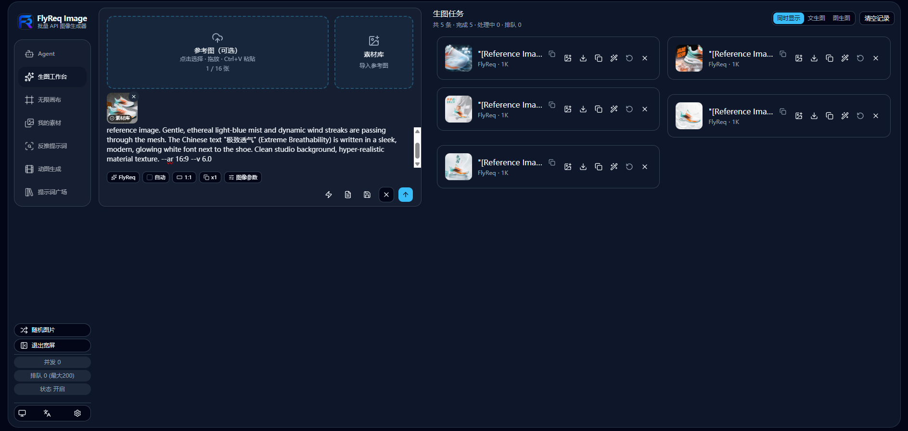 | 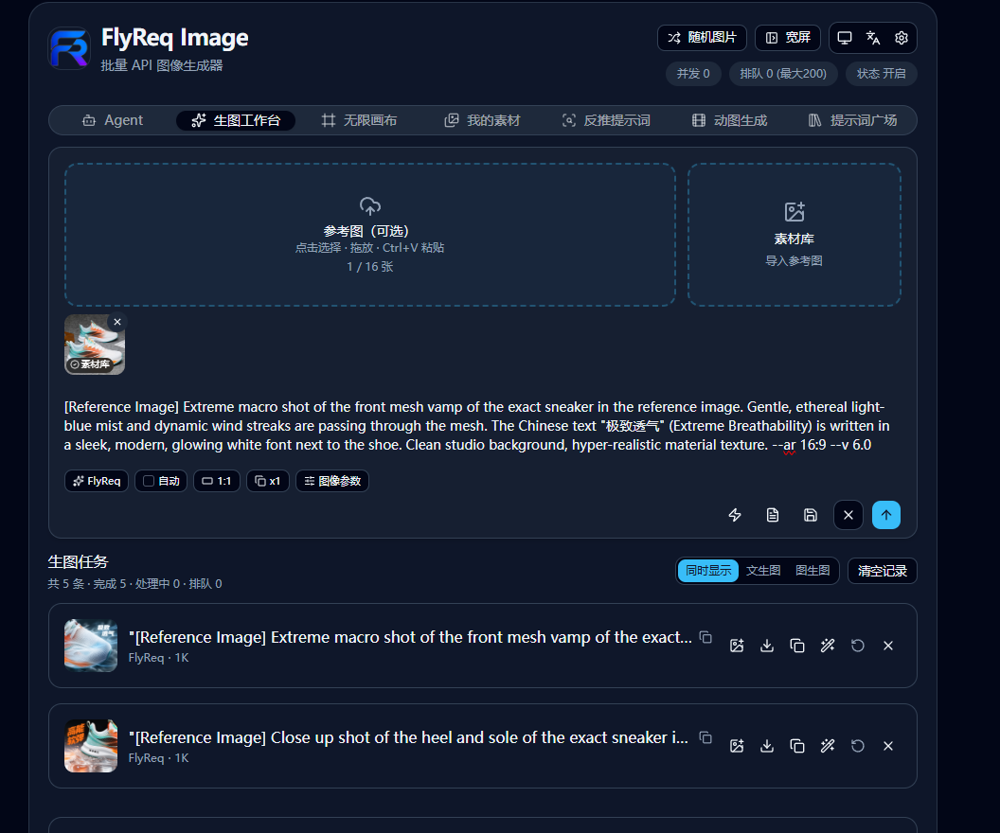 | 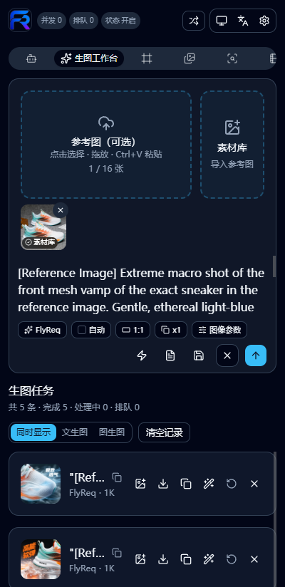 |

### Agent Mode

| Planning | Generation |
|:---:|:---:|
| 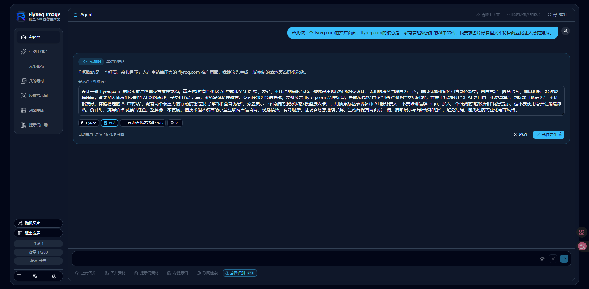 | 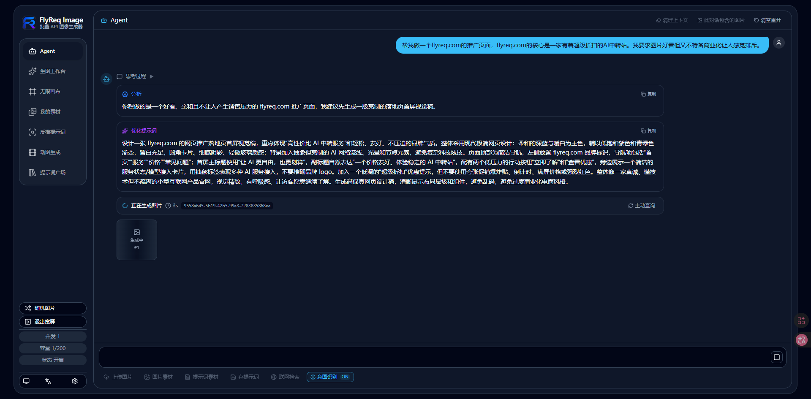 |

### GIF Workflow

| Generation | Refinement |
|:---:|:---:|
|  | 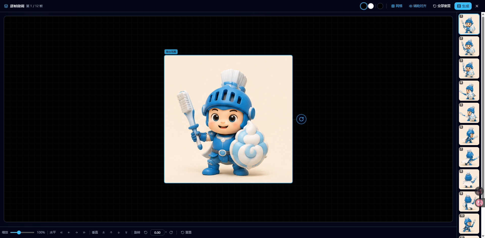 |

### Infinite Canvas


### Prompt Optimization

| Entry point | Result |
|:---:|:---:|
| 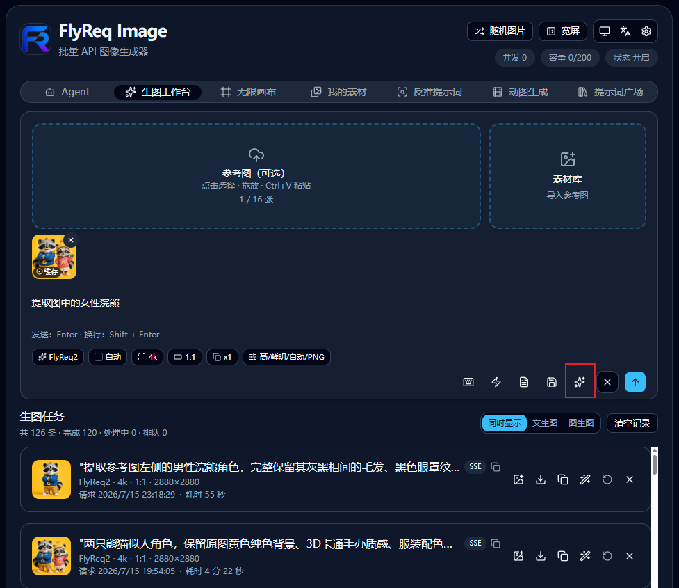 | 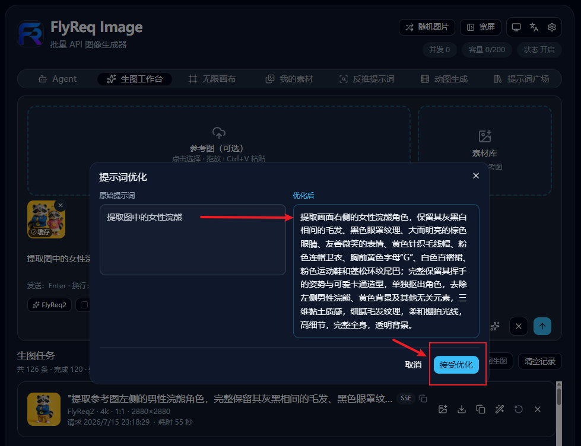 |

### Inspiration and Assets

| Prompt Gallery | My Assets |
|:---:|:---:|
| 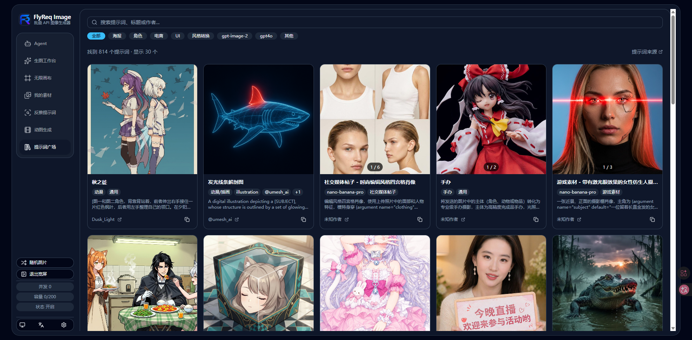 |  |

### Configuration and Creation

| Reverse Prompt | Settings |
|:---:|:---:|
| 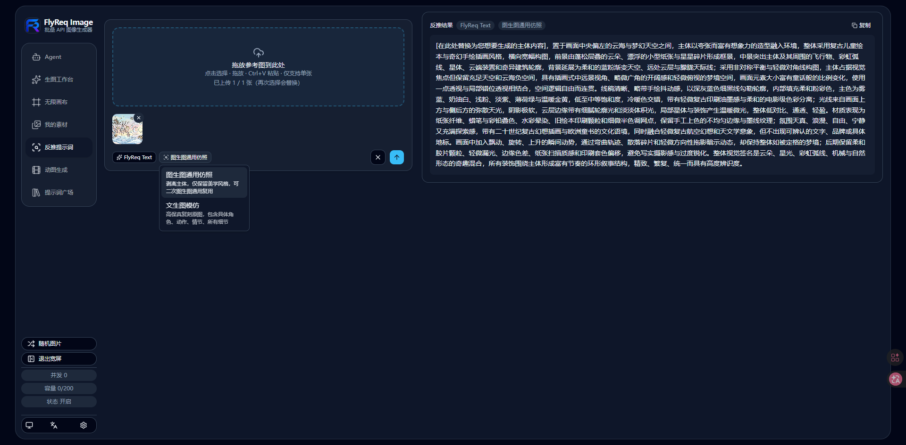 | 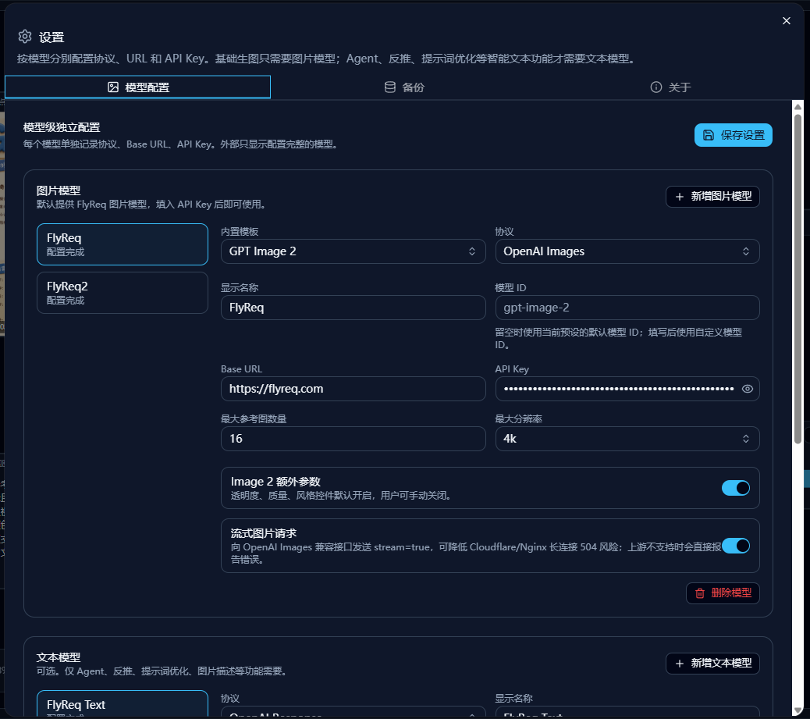 |

---

## Workflows

| Workflow | What it does |
| --- | --- |
| Text to Image | Generate images from prompts with parallel output support. |
| Image to Image | Edit, transform, or stylize uploaded reference images. |
| Agent | Turn multi-turn chat into an image plan and generation request, with vision descriptions, web search, and reasoning support. |
| Reverse Prompt | Stream a prompt analysis from an uploaded image through a configured text model. |
| GIF Generation | Generate multiple frames, assemble a grid, and encode the GIF in the browser with `gifenc`. |
| Infinite Canvas | Arrange images and text on a visual workspace, then pass connected context into image generation. |

## Supported Models and Protocols

| Type | Built-in presets or protocol | Available capabilities |
| --- | --- | --- |
| Google image models | Gemini 2.5 Flash Image, Gemini 3 Pro Image Preview, Gemini 3.1 Flash Image Preview, Gemini 3.1 Flash Lite Image | Text-to-image, image-to-image, model-specific reference-image limits, 1K to 4K output, and optional `temperature`. |
| OpenAI image models | GPT Image 2 and OpenAI Images-compatible endpoints | GPT Image 2 supports text-to-image, image-to-image, up to 16 references, 1K to 4K, quality, style, transparent backgrounds, PNG/JPEG/WebP, custom sizes, and streaming image requests. Compatible gateways expose the parameters their upstream supports. |
| xAI image models | Grok Imagine and Grok Imagine Quality | xAI Imagine request adapter, 1K or 2K output, and preset-supported aspect ratios. |
| Text models | Google `generateContent` and OpenAI Responses-compatible endpoints | Reverse prompting, prompt optimization, and Agent chat-to-image planning. |
| Custom models | `google` or `openai` compatible services | Custom model ID, base URL, API key, reference-image limit, output limit, and capability toggles. |

Presets define a safe capability boundary, not a provider lock-in. Supply the actual base URL, model ID, and API key for a compatible service. Google and xAI image APIs do not receive `stream=true`; OpenAI Images-compatible GPT Image 2 requests can enable streaming by default.

### Why It Is Different

- **Intent-aware Agent routing:** The Agent considers the requested resolution, available image models, and reference-image aspect ratio, then normalizes settings to the selected model's supported range.
- **One configuration surface:** Deployment variables provide a branded first-run experience, while external links can hand users a model draft that still requires confirmation.
- **Compatibility with diagnostics:** Server-side base-URL rewrites route public settings to internal services without changing what users saved. Upstream response bodies are retained for investigation.
- **Recoverable job system:** SQLite-backed jobs, WebSocket updates, reconnect with polling fallback, on-disk outputs, retry, download, backup, and restore are built in.

## Prompt Gallery

`PROMPT_GALLERY_MODE` controls how the gallery is exposed:

- `1`: Always visible.
- `2`: Private, protected by `PROMPT_GALLERY_PASSWORD`.
- `3`: Hidden.

Gallery content lives in `backend/prompts.json` and supports filtering through `backend/blacklist.json`.

## External Model Configuration Links

External sites can link to FlyReq Image with a `provider` query parameter containing model configuration JSON. The application opens Settings, fills the draft, removes the parameter from the address bar, and waits for the user to save it.

```json
{
  "type": "image",
  "preset": "gpt-image-2",
  "provider": "openai",
  "modelKey": "flyreq-gpt-image-2",
  "name": "FlyReq",
  "modelId": "gpt-image-2",
  "baseUrl": "https://flyreq.com",
  "apiKey": "YOUR_API_KEY",
  "maxRefImages": 16,
  "maxOutputSize": "4K",
  "supportsTemperature": false,
  "streamImages": true
}
```

Use URL-encoded JSON in production links. Matching first uses `modelKey`, then `name + modelId + baseUrl`; otherwise, a new model is drafted. The API key is removed from the address bar after parsing, but it is briefly present in the URL, so distribute these links carefully.

Example links:

Raw JSON:

```text
https://image.flyreq.com/en/?provider={"type":"image","preset":"gpt-image-2","provider":"openai","modelKey":"flyreq-gpt-image-2","name":"FlyReq","modelId":"gpt-image-2","baseUrl":"https://flyreq.com","apiKey":"YOUR_API_KEY","maxRefImages":16,"maxOutputSize":"4K"}
```

URL-encoded JSON:

```text
https://image.flyreq.com/en/?provider=%7B%22type%22%3A%22image%22%2C%22preset%22%3A%22gpt-image-2%22%2C%22provider%22%3A%22openai%22%2C%22modelKey%22%3A%22flyreq-gpt-image-2%22%2C%22name%22%3A%22FlyReq%22%2C%22modelId%22%3A%22gpt-image-2%22%2C%22baseUrl%22%3A%22https%3A%2F%2Fflyreq.com%22%2C%22apiKey%22%3A%22YOUR_API_KEY%22%2C%22maxRefImages%22%3A16%2C%22maxOutputSize%22%3A%224K%22%7D
```

| Field | Description |
| --- | --- |
| `type=image` | Image models are currently supported. |
| `modelKey` | Optional stable model ID. Updates an existing model with the same ID. |
| `preset` | Optional built-in preset, such as `gpt-image-2`. |
| `provider` | Optional: `openai` or `google`. |
| `name` | Display name. |
| `modelId` | Upstream model ID. |
| `baseUrl` | Upstream base URL. |
| `apiKey` | API key. |
| `maxRefImages` | Maximum number of reference images. |
| `maxOutputSize` | Maximum output size: `512`, `1K`, `2K`, or `4K`. |
| `supportsTemperature` | Optional. Applies only to Google image models; `true` shows and sends `temperature`. |
| `streamImages` | Optional. Applies only to OpenAI Images-compatible models; `true` enables streaming image requests. |

When the supplied model is complete, it becomes the default for text-to-image and image-to-image. The browser removes the API key from the address bar immediately after parsing, but distribute these links carefully because the key is briefly present in the URL.

## Deployment

<details>
<summary><strong>Docker Compose deployment</strong></summary>

### Requirements

- Docker 20.10+
- Docker Compose v2

### Quick start

The default installation directory is `/opt/fis`. The following commands download the four files required for deployment directly from [doudou770/flyreq-image-studio](https://github.com/doudou770/flyreq-image-studio):

- `docker-compose.yml`: Docker Compose service definition
- `.env`: backend runtime configuration
- `prompts.json`: Prompt Gallery content
- `blacklist.json`: sensitive-word configuration

```bash
# 1. Create and enter the deployment directory
sudo mkdir -p /opt/fis
cd /opt/fis

# 2. Download the Docker Compose configuration
sudo curl -fsSL \
  https://raw.githubusercontent.com/doudou770/flyreq-image-studio/master/docker-compose.yml \
  -o docker-compose.yml

# 3. Download the environment template as .env
sudo curl -fsSL \
  https://raw.githubusercontent.com/doudou770/flyreq-image-studio/master/backend/.env.example \
  -o .env

# 4. Download prompt and blacklist configuration
sudo curl -fsSL \
  https://raw.githubusercontent.com/doudou770/flyreq-image-studio/master/backend/prompts.json \
  -o prompts.json
sudo curl -fsSL \
  https://raw.githubusercontent.com/doudou770/flyreq-image-studio/master/backend/blacklist.json \
  -o blacklist.json

# 5. Create the persistent data directory
sudo mkdir -p data

# 6. Edit configuration when needed
sudo nano .env

# 7. Start the service
sudo docker compose up -d
```

Open <http://localhost:3001> after startup. `docker-compose.yml` uses:

```yaml
image: ghcr.io/doudou770/flyreq-image-studio:latest
```

If the GitHub Container Registry package is private, authenticate first:

```bash
echo YOUR_GITHUB_TOKEN | docker login ghcr.io -u YOUR_GITHUB_USERNAME --password-stdin
```

### File layout and persistence

```text
/opt/fis/
├── docker-compose.yml
├── .env
├── prompts.json
├── blacklist.json
└── data/
```

The Compose file persists the task database and generated images under `/opt/fis/data/` through:

```yaml
FLYREQ_TASK_DB: /app/backend/data/flyreq-tasks.sqlite
FLYREQ_IMAGE_DIR: /app/backend/data/flyreq-images
```

The default Compose file joins the common 1Panel external network `1panel-network`, allowing Docker-internal access to services such as new-api. Change the `networks` name for another 1Panel network. Outside 1Panel, remove that network configuration or create it first:

```bash
sudo docker network create 1panel-network
```

### Runtime configuration and updates

Configure the container through `/opt/fis/.env`; no image rebuild is required. Restart the container after changing startup settings such as `PORT`, `HOSTNAME`, or `NODE_ENV`:

```bash
cd /opt/fis
sudo docker compose restart
```

Queue, rate-limit, and Prompt Gallery settings are refreshed by the backend and normally take effect after saving `.env` without a restart.

Use `FLYREQ_BASE_URL_REWRITE_MAP` when users configure a public base URL but server-side requests should use a Docker-internal address:

```env
FLYREQ_BASE_URL_REWRITE_MAP={"https://flyreq.com":"http://new-api:3000"}
```

Multiple mappings are supported:

```env
FLYREQ_BASE_URL_REWRITE_MAP={"https://flyreq.com":"http://new-api:3000","https://api.example.com":"http://example-new-api:3000"}
```

Matching ignores a trailing `/v1` or `/v1beta`. The mapping changes only outbound server requests and never changes a user's saved model configuration.

Upgrade with:

```bash
cd /opt/fis
sudo docker compose pull
sudo docker compose up -d --force-recreate
```

Back up the entire `/opt/fis` directory to retain `flyreq-images/`, `flyreq-tasks.sqlite`, and the SQLite WAL/SHM runtime files.

</details>

<details>
<summary><strong>Local production deployment</strong></summary>

### Requirements

- Node.js 20 or 22
- npm with workspace support
- `better-sqlite3` is native: run `npm ci --omit=dev` on the production server. Do not copy a local `node_modules` directory.

### Deployment steps

Build on the build machine:

```bash
npm ci
npm run build
```

Upload the following to the production server:

```text
frontend/out/
backend/server.js
backend/package.json
backend/package-lock.json
backend/prompts.json
backend/blacklist.json
backend/.env
```

Then install and run on the production server:

```bash
npm ci --omit=dev
npm start
```

Set `NODE_ENV=production` in `.env`. Use PM2, systemd, or your platform process manager. The process needs read/write access to `FLYREQ_TASK_DB`, and the reverse proxy should route the domain to `http://127.0.0.1:3001`.

Create a deployable archive with:

```bash
npm run go
```

It produces `out.zip` at the repository root.

</details>

<details>
<summary><strong>Local development</strong></summary>

### Requirements

- Node.js 20 or 22
- npm with workspace support

### Install and run

```bash
git clone https://github.com/doudou770/flyreq-image-studio.git
cd flyreq-image-studio
npm install
cp backend/.env.example backend/.env
# Windows: Copy-Item backend/.env.example backend/.env
npm run dev
```

Open <http://localhost:3001>. At first startup, the image workspace uses the deployment default image model, or the FlyReq / GPT Image 2 preset if no deployment default is configured. API keys are not delivered through deployment settings. Add image and text model API keys in **Settings**, then confirm workflow defaults. Browser-side configuration can be exported through backup.

### Common scripts

```bash
npm run dev:frontend   # Next.js dev server only (HMR; no static export)
npm run dev:backend    # backend server.js only
npm run build          # static frontend output in frontend/out/
npm start              # backend server.js
npm run lint           # frontend ESLint
npm test               # Vitest watch mode
npm run test:run       # Vitest once
npm run go             # build and package root out.zip
```

</details>

<details>
<summary><strong>Build a Docker image</strong></summary>

```bash
docker build -t flyreq-image-studio:latest .
docker tag flyreq-image-studio:latest ghcr.io/doudou770/flyreq-image-studio:latest
docker push ghcr.io/doudou770/flyreq-image-studio:latest
```

</details>

<details>
<summary><strong>GitHub Actions release</strong></summary>

Run `.github/workflows/release.yml` from **Actions -> Release -> Run workflow** on `master`, then choose `patch`, `minor`, or `major`. The workflow calculates the next `vX.Y.Z` tag, creates the GitHub Release, passes the version to the Docker image as `APP_VERSION`, and publishes these images:

- `ghcr.io/doudou770/flyreq-image-studio:latest`
- `ghcr.io/doudou770/flyreq-image-studio:X.Y.Z`
- `ghcr.io/doudou770/flyreq-image-studio:vX.Y.Z`

The built-in `GITHUB_TOKEN` requires Actions permission to write `contents` and `packages`.

</details>

### Important Environment Variables

| Variable | Required | Default | Description |
| --- | --- | --- | --- |
| `PORT` | No | `3001` | Listening port. |
| `HOSTNAME` | No | `0.0.0.0` | Bind address. `localhost` and `127.0.0.1` are local-only. |
| `NODE_ENV` | **Yes** | `production` | **Must be `production`**; otherwise the Next development server is used. |
| `FLYREQ_TASK_DB` | No | `./flyreq-tasks.sqlite` | SQLite database path. Use a persistent directory. |
| `FLYREQ_TASK_CONCURRENCY` | No | `50` | Maximum concurrent jobs; hard limit is 50. |
| `FLYREQ_MAX_QUEUE_SIZE` | No | `200` | Maximum pending jobs globally. |
| `FLYREQ_RATE_LIMIT_WINDOW_MS` | No | `60000` | Task-creation rate-limit window in milliseconds. |
| `FLYREQ_RATE_LIMIT_MAX_REQUESTS_PER_IP` | No | `20` | Maximum task creations per IP in one window. |
| `FLYREQ_RATE_LIMIT_MAX_REQUESTS_PER_API_KEY` | No | `20` | Maximum task creations per API key in one window. |
| `FLYREQ_MAX_PENDING_TASKS_PER_IP` | No | `20` | Maximum pending jobs per IP. |
| `FLYREQ_MAX_PENDING_TASKS_PER_API_KEY` | No | `20` | Maximum pending jobs per API key. |
| `FLYREQ_RATE_LIMIT_RETRY_AFTER_SECONDS` | No | `30` | `Retry-After` seconds for a full queue or rate limit. |
| `FLYREQ_IMAGE_DIR` | No | `backend/flyreq-images/` | Directory for generated image files. |
| `FLYREQ_BASE_URL_REWRITE_MAP` | No | Empty | Outbound base-URL rewrite map, for example `{"https://flyreq.com":"http://new-api:3000"}`. |
| `FLYREQ_OUTBOUND_USER_AGENT` | No | `FlyReq-Image-Studio/1.5.1` | Stable identifier sent upstream. Use a deployment-traceable product name; do not impersonate browsers or third-party services. |
| `FLYREQ_PLATFORM_NAME` | No | `FlyReq Image` | Product name used in the page title, header, Settings, and PWA. |
| `FLYREQ_PLATFORM_LOGO_URL` | No | `/favicon.png` | Header logo. Only an on-site absolute path or HTTP(S) URL is allowed. |
| `FLYREQ_PLATFORM_ICON_URL` | No | `/favicon.png` | Browser favicon and PWA icon. Only an on-site absolute path or HTTP(S) URL is allowed. |
| `FLYREQ_IMAGE_MODEL_KEY_GUIDE_TITLE` | No | `Need an image model API key?` | Image-model key guide title in Settings. |
| `FLYREQ_IMAGE_MODEL_KEY_GUIDE_DESCRIPTION` | No | FlyReq default description | Image-model key guide description in Settings. |
| `FLYREQ_IMAGE_MODEL_KEY_GUIDE_CTA_LABEL` | No | `Visit flyreq.com` | Image-model key guide button label. |
| `FLYREQ_IMAGE_MODEL_KEY_GUIDE_URL` | No | `https://flyreq.com` | Image-model key guide destination. |
| `FLYREQ_DEFAULT_IMAGE_MODEL_KEY` | No | `flyreq-gpt-image-2` | Stable internal key for the first default image model. |
| `FLYREQ_DEFAULT_IMAGE_MODEL_NAME` | No | `FlyReq` | Display name of the first default image model. |
| `FLYREQ_DEFAULT_IMAGE_MODEL_PROTOCOL` | No | `openai` | First default image-model protocol: `openai` or `google`. |
| `FLYREQ_DEFAULT_IMAGE_MODEL_BASE_URL` | No | `https://flyreq.com` | Base URL of the first default image model. |
| `FLYREQ_DEFAULT_IMAGE_MODEL_MODEL_ID` | No | Empty | Actual model ID. When blank, the preset model-ID mapping is used. |
| `FLYREQ_DEFAULT_IMAGE_MODEL_PRESET` | No | `gpt-image-2` | Built-in image preset ID, which defines the capability boundary. |
| `FLYREQ_DEFAULT_IMAGE_MODEL_MAX_REF_IMAGES` | No | `16` | Maximum reference images, from 1 to 16. |
| `FLYREQ_DEFAULT_IMAGE_MODEL_MAX_OUTPUT_SIZE` | No | `4K` | Maximum output size: `512`, `1K`, `2K`, or `4K`. |
| `FLYREQ_DEFAULT_IMAGE_MODEL_SUPPORTS_ADVANCED_PARAMS` | No | `true` | Enables GPT Image 2 advanced parameters by default. |
| `FLYREQ_DEFAULT_IMAGE_MODEL_SUPPORTS_TEMPERATURE` | No | `false` | Whether the Google image model supports `temperature` by default. |
| `FLYREQ_DEFAULT_IMAGE_MODEL_STREAM_IMAGES` | No | `true` | Enables streaming image requests for OpenAI GPT Image 2 by default. |
| `PROMPT_GALLERY_MODE` | No | `2` | `1` always visible / `2` password-protected / `3` hidden. |
| `PROMPT_GALLERY_PASSWORD` | No | Empty | Prompt Gallery password in private mode. Private mode opens directly when empty. |

For example, keep a public URL in browser-side model settings while routing server-side requests to a Docker network service:

```env
FLYREQ_BASE_URL_REWRITE_MAP={"https://flyreq.com":"http://new-api:3000"}
```

This mapping changes only outbound server requests. It never rewrites the user's stored model configuration.

Most runtime settings in `.env` take effect without a restart, including concurrency, rate limits, queue capacity, accepting-new-tasks, outbound base-URL rewrites, Prompt Gallery settings, and the image-model key guide. Restart after changing startup settings such as `PORT`, `HOSTNAME`, or `NODE_ENV`.

## Task System

- Jobs enter a server-side queue with configurable concurrency and rate limits.
- Browsers receive job and queue changes through WebSocket, reconnect automatically, and fall back to HTTP polling after repeated failures.
- Generated files are stored on disk and served from `/api/flyreq/images/:taskId/:index`.
- Jobs expire after 12 hours and are cleaned up automatically.
- A restart marks incomplete jobs as failed and removes their partial output, preventing orphaned tasks.

## Engineering and UX

- Installable PWA through `next-pwa`.
- Responsive desktop, tablet, and mobile layouts.
- Light and dark themes plus wide and narrow workspace layouts.
- Task history persisted with IndexedDB and localStorage.
- One-click backup and restore through JSZip, including partial recovery when older settings are incompatible.
- Virtualized lazy loading for historical images through `@tanstack/react-virtual`.
- Random images, toast notifications, and confirmation dialogs.

## Project Structure

```text
flyreq-image-studio/
├── frontend/                 # Next.js frontend (React 19 + TypeScript)
│   ├── src/
│   │   ├── app/              # Root layout and pages
│   │   ├── components/       # Feature components and shadcn/ui primitives
│   │   │   ├── workspace/    # Workspace shell, tabs, header, and results
│   │   │   ├── agent/        # Agent-mode components
│   │   │   └── ui/           # UI primitives
│   │   ├── hooks/            # Queue, Agent, GIF, and other hooks
│   │   ├── lib/              # Client utilities, API clients, WebSocket, backup
│   │   └── test/             # Vitest configuration and tests
│   ├── public/               # PWA icons and static assets
│   ├── next.config.ts        # Static export and next-pwa configuration
│   ├── package.json
│   └── vitest.config.ts
├── backend/
│   ├── server.js             # Node server: HTTP, WS, SQLite, and task queue
│   ├── prompts.json          # Prompt Gallery content
│   ├── blacklist.json        # Sensitive-word list
│   ├── .env.example
│   └── package.json
├── scripts/
│   ├── pack.js               # Build and package out.zip
│   └── generate-icons.js     # Generate PWA icons
├── package.json              # npm workspaces root
├── LICENSE                   # AGPL-3.0 license
└── README.md
```

Production builds are emitted to `frontend/out/` and served statically by `backend/server.js`.

## API

| Method | Path | Purpose |
| --- | --- | --- |
| `POST` | `/api/flyreq/tasks/batch` | Submit multiple independent image tasks; returns ordered `taskIds`. |
| `POST` | `/api/flyreq/tasks` | Submit one image-generation task; returns `taskId` with HTTP 202. |
| `GET` | `/api/flyreq/tasks/:taskId` | Read task status and results. |
| `POST` | `/api/flyreq/tasks/:taskId/ack` | Extend an existing task's retrieval TTL by two minutes. |
| `GET` | `/api/flyreq/queue-status` | Read active, queued, and accepting status. |
| `GET` | `/api/flyreq/prompts` | Read Prompt Gallery content. |
| `GET` | `/api/flyreq/blacklist` | Read the sensitive-word list. |
| `GET` | `/api/flyreq/config` | Read browser runtime configuration. |
| `GET` | `/api/flyreq/manifest.webmanifest` | Read the runtime PWA manifest. |
| `GET` | `/api/flyreq/images/:taskId/:index/:subIndex` | Read a generated image; omit `subIndex` for image 0. |
| `WS` | `/api/flyreq/ws` | Subscribe to task and queue updates. |

### Task statuses

- `queued`: Waiting for scheduling.
- `processing`: Calling the upstream API.
- `completed`: Succeeded; `result.images` contains result URLs.
- `failed`: Failed; see `error`.
- `expired`: Exceeded the task TTL.

## Troubleshooting

**Why not use `next start` in production?**

The project uses `output: 'export'`, producing a static `frontend/out/` directory. `server.js` hosts both the static files and task API, so `next start` is not used.

**Can I deploy only `frontend/out/`?**

The UI opens, but task submission, Agent, and history synchronization require `/api/flyreq/*`; run `server.js` as well.

**Does the database need a separate backup?**

The service creates it automatically. To retain task data, back up `flyreq-tasks.sqlite` with its WAL/SHM files and `flyreq-images/`. A restart marks remaining active tasks as failed and cleans up their output.

**How do I temporarily stop accepting new tasks without stopping the service?**

Set the following in `.env`:

```env
FLYREQ_ACCEPT_NEW_TASKS=false
```

It takes effect after saving. Wait for in-flight tasks before restarting for an upgrade. Set it to `true` or leave it empty to accept tasks again.

**When do tasks expire?**

Tasks expire 12 hours after creation. When the frontend receives a result, it calls `/ack` to extend retrieval by two minutes. The server removes the database record and result images after expiry.

**Why can an upstream console show success while FlyReq Image reports 504?**

Cloudflare, Nginx, or another gateway can close a long-running response before the upstream image job finishes. Prefer a Docker-internal or DNS-only upstream address, configure `FLYREQ_BASE_URL_REWRITE_MAP`, and enable streaming image requests for compatible OpenAI Images endpoints. The original upstream error is kept in the task failure message.

---

## Acknowledgements

The infinite-canvas workspace is built on [infinite-canvas](https://github.com/basketikun/infinite-canvas). Thanks to its author, [basketikun](https://github.com/basketikun), for the open-source contribution, and to [tianjiangqiji](https://github.com/tianjiangqiji/nova-image-studio) for the open-source UI.

Thanks to the [Linux.do](https://linux.do/) community for its support.

---

## Star History

<a href="https://www.star-history.com/?repos=doudou770%2Fflyreq-image-studio&type=date&legend=top-left">
 <picture>
   <source media="(prefers-color-scheme: dark)" srcset="https://api.star-history.com/chart?repos=doudou770/flyreq-image-studio&type=date&theme=dark&legend=top-left&sealed_token=9dZ2kL1_BV4KpieyukOjBrWI3rQ-tdq9WN0wqR46Pz1sBxU5ptf32X4FcKFsxFcnD7lVvu2XnhlOsGKRYtOg4_GiXLKgQ1W14VOvTb7CVgIW4p_i4X5elQ" />
   <source media="(prefers-color-scheme: light)" srcset="https://api.star-history.com/chart?repos=doudou770/flyreq-image-studio&type=date&legend=top-left&sealed_token=9dZ2kL1_BV4KpieyukOjBrWI3rQ-tdq9WN0wqR46Pz1sBxU5ptf32X4FcKFsxFcnD7lVvu2XnhlOsGKRYtOg4_GiXLKgQ1W14VOvTb7CVgIW4p_i4X5elQ" />
   
 </picture>
</a>

---

## License

Released under the [AGPL-3.0](LICENSE) license.

For the complete Chinese deployment guide, environment-variable reference, and operational FAQ, see [README.zh-CN.md](./README.zh-CN.md).
